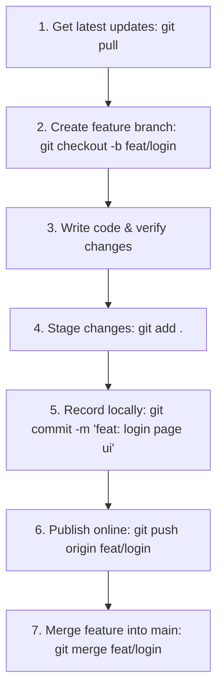

# Git & GitHub Basics Study Guide 🚀

This study guide explains the essential Git and GitHub commands covered in the **"GitHub Command in 60 Seconds: Master Git Basics"** tutorial by *Topictrick*. It includes visual models, step-by-step explanations, and real-world workflows to help you master Git basics.

---

## 💡 The Git Architecture

Git separates your project into **four main environments**. Understanding where your code lives in each of these environments is the key to mastering Git:

```text
 ┌───────────────────┐        git add        ┌───────────────────┐
 │ Working Directory │──────────────────────>│   Staging Area    │
 │ (Local files)     │                       │ (Pre-commit zone) │
 └───────────────────┘                       └───────────────────┘
           │                                           │
           │ git clone                                 │ git commit
           ▼                                           ▼
 ┌───────────────────┐        git push       ┌───────────────────┐
 │ Remote Repository │<──────────────────────│ Local Repository  │
 │ (GitHub/GitLab)   │──────────────────────>│ (.git database)   │
 └───────────────────┘        git pull       └───────────────────┘
```

1. **Working Directory:** The actual files you are currently editing on your computer.
2. **Staging Area (Index):** A temporary preview area where you prepare changes before saving them.
3. **Local Repository:** The permanent, history-tracked database on your machine (stored hidden inside `.git`).
4. **Remote Repository:** The hosted platform online (like GitHub) that allows you to share and back up code.

---

## 🛠️ The 8 Essential Git Commands

### 1. `git clone` (Downloading a Project)
Downloads an existing project from GitHub onto your local computer.
*   **Syntax:**
    ```bash
    git clone <repository-url>
    ```
*   **What it does:** Initializes a hidden `.git` folder locally, downloads the full project commit history, and creates copy of the files on the default branch.
*   **Real-world Analogy:** Downloading a copy of a shared folder from Google Drive to your local machine, along with all its revision history.

---

### 2. `git add` (Staging Changes)
Prepares files in your working directory to be committed.
*   **Syntax:**
    ```bash
    # Stage a single file
    git add filename.py

    # Stage all new, modified, and deleted files
    git add .
    ```
*   **What it does:** Tells Git, *"I want these exact changes to be packed into the next snapshot."*
*   **Real-world Analogy:** Placing items into a shipping box. You've placed them in, but you haven't sealed or labeled the box yet.

---

### 3. `git commit` (Saving a Snapshot)
Permanently saves your staged changes to your **Local Repository**.
*   **Syntax:**
    ```bash
    git commit -m "Your descriptive commit message"
    ```
*   **What it does:** Creates a permanent snapshot (checkpoint) with a unique ID (SHA-1 hash). It records who made the change, when, and why.
*   **Real-world Analogy:** Sealing the box with tape, writing a clear label describing what is inside, and locking it in your home vault.

---

### 4. `git push` (Uploading Online)
Uploads your local commits to a **Remote Repository** (e.g. GitHub).
*   **Syntax:**
    ```bash
    git push <remote-name> <branch-name>

    # Example:
    git push origin main
    ```
*   **What it does:** Sends all your local commit snapshots online, updating the remote repository so your teammates can see them.
*   **Real-world Analogy:** Shipping your sealed cardboard box from your home vault to the central company warehouse.

---

### 5. `git pull` (Downloading Updates)
Fetches updates from the remote repository and immediately merges them into your active files.
*   **Syntax:**
    ```bash
    git pull <remote-name> <branch-name>

    # Example:
    git pull origin main
    ```
*   **What it does:** Combines two steps:
    1.  `git fetch`: Downloads new changes from online.
    2.  `git merge`: Unpacks and combines those changes directly into your current local files.
*   **Real-world Analogy:** Checking the central company warehouse for new shipments from coworkers, bringing them home, and blending their improvements into your local workbench.

---

### 6. `git branch` (Creating Sandboxes)
Creates an isolated, parallel timeline for your development.
*   **Syntax:**
    ```bash
    # List all local branches
    git branch

    # Create a new branch
    git branch <new-branch-name>
    ```
*   **What it does:** Creates a pointer to your current commit under a new name. This lets you experiment safely without affecting the main (`main`/`master`) codebase.
*   **Real-world Analogy:** Forking the timeline into a parallel universe where you can safely experiment without breaking the real world.

---

### 7. `git checkout` (Switching Timelines)
Switches your active workspace to a different branch.
*   **Syntax:**
    ```bash
    git checkout <branch-name>

    # Create and immediately switch to a new branch (Shorthand):
    git checkout -b <new-branch-name>
    ```
*   **What it does:** Swaps all the files in your Working Directory to match the snapshots saved in the target branch.
*   **Real-world Analogy:** Teleporting yourself to that parallel universe so you can start working inside it.
*   > [!NOTE]
    > In newer versions of Git, you can also use `git switch <branch-name>` to switch branches.

---

### 8. `git merge` (Combining Work)
Integrates changes from another branch into your current active branch.
*   **Syntax:**
    ```bash
    git merge <branch-name>
    ```
*   **What it does:** Combines the histories of two branches. If there are lines where both branches made conflicting changes, Git will trigger a **Merge Conflict** and prompt you to choose which code to keep.
*   **Real-world Analogy:** Returning from your parallel universe and blending your successful experiments into the primary timeline.

---

## 🚀 Daily Professional Workflow

Here is how a developer uses these commands consecutively on a normal workday:



### Command Sequence:
```bash
# Step 1: Ensure you are on main and up to date
git checkout main
git pull origin main

# Step 2: Create a branch for a new task
git checkout -b study-git-lesson

# Step 3: (Write code, make files, edit views...)

# Step 4: Check what you modified
git status

# Step 5: Stage and commit your work
git add .
git commit -m "Doc: add git basics lesson guide"

# Step 6: Push your branch online
git push origin study-git-lesson
```

---

## ⚠️ Pro-Tips & Common Mistakes

> [!TIP]
> **Commit Often, Push Selectively:** Make small, logical commits. It makes tracking bugs infinitely easier than making one massive commit at the end of the day.

> [!WARNING]
> **Never Commit Directly to main/master:** Always create a new branch for features, fixes, or lessons. Keep your `main` branch clean and deployable.

> [!IMPORTANT]
> **Handling Merge Conflicts:** If a merge conflict happens, don't panic! Open the conflicted files in VS Code or your editor, locate the conflict markers (`<<<<<<<`, `=======`, `>>>>>>>`), choose the correct lines of code, save the files, then run:
> ```bash
> git add .
> git commit -m "Merge branch and resolve conflicts"
> ```
